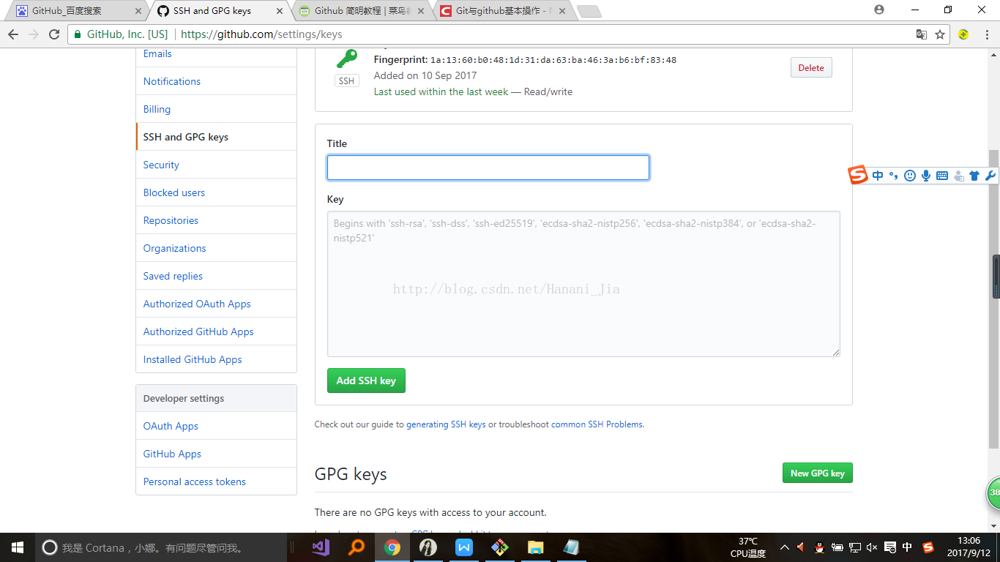
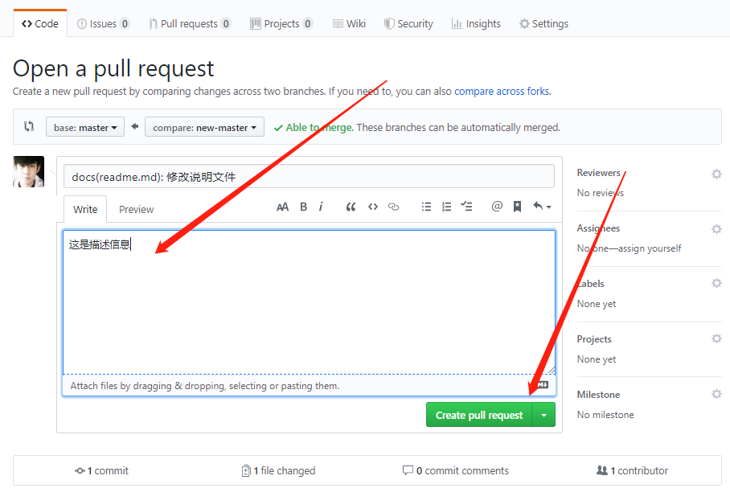

# github

* 开始之前为初级教程适合没有接触过github的同学阅读

* 发布第一个github仓库为中级教程适合使用过github的同学，但是不是特别熟悉的同学阅读

* 企业中github的实战应用为高级教程，适合所有人阅读

    **请大家根据自己的情况与学习本次教程**

    **如有问题联系作者本人**

    **微信: 18329723317**

## 开始之前

1. 注册并登录github账号


2. 下载gitbash工具

    它是一个可以远程连接github仓库的工具


    安装过程中点击下一步，安装路径自选


3. 让git远程指导你用的是那一台计算机

    * 鼠标右击打开gitBash输入以下代码

        `ssh-keygen-t rsa-C "你注册时候的邮箱地址"`

    * 这个时候它会提示您输入密码,其它的只需要一直按下回车即可

    * 接下来它会在你的电脑生成一个.ssh文件夹


    * 请用你常用的编辑器打开id_rsa.pub文件(请把文件显示的方式为扩展名显示),这个时候会看到一长串不知道什么玩意的代码(注意:这里先放着，不要动，后期有用)

    * 打开你的git,找到settings选项，选择SSH and GPG keys



    title名字随意，将上文的那段密钥放进去ok

4. 查看git是否认识你的计算机

    * 鼠标右击打开gitbash,输入

        `ssh -T github名字@github.com`

        如果出现

        `You've successfully authenticated, but GitHub does not provide shell access`则绑定ok

    * 设置git的全局用户名及邮箱

        `git config --global user.name "github名字"`

        `git config --global user.email "注册github时候的邮箱"`

    
## 发布第一个demo

1. 进入github主页Repositories(你将来所有项目展现的地方)

    点击绿色new按钮


    可以看到的界面


    * Repository name指的是项目名字(随意起)

        这里起名字为my-study-github

    * Description 项目描述(随意写)

        这里写为：study github demo

    * public为公有仓库(所有人都可以看到的)

    * private为私有仓库(只有自己和自己规定的人可以看到，在公司里面也一般是private仓库)

    这里选择public

    * readme.md说明文件(可选)

        这里选择是

    * .gitignore为git的配置文件(本文后期会讲到,先不选)

    * Add a license这里为协议文件，常见的如MIT协议(所有人都可以用的，具体协议大家百度)，这里选择MIT协议


    * 点击绿色按钮创建，然后看到如下图的界面

    这里选中绿色按钮Clone or download,出现地址，点击则默认复制


2. 将代码下载到本地

    * 找到本地文件夹鼠标右击打开gitbash,输入以下命令

    `git clone https://github.com/wuhaohao1234/my-study-github.git`

    * 进入克隆下的文件夹my-study-github

    `cd my-study-github`

    * 这里可以看到几个文件:

        .git文件夹(默认为隐藏不可见文件夹，需要在文件显示那里勾选，具体方法自行百度)

        里面纪录了github中文件所有的版本库有哪些

        这里补充一点：**git之所以被这么多人使用，正是因为它有版本库，代码时间节点的概念**

        readme.md文件

        你当时写的说明文件

    * 还可以看到在最上头的文件地址后面有个master

        这里补充下:

        **git具有一种分支的概念，可以理解为，一个分支就是一套文件，当选择不同的分支的时候，看到的文件就会不同，现在目前只有主分支master分支**

3. 编辑我们写的文件

    在企业开发中，切记: **一定不要再master分支上开发我们的代码**

    master分支一般都是产品发布的分支，一旦有一名程序员在master分支上写代码，后果可能会被多名程序员打死

    * 新建我们自己写代码的一个分支,输入:

        `git branch new-master`

        `git branch 分支名称` 可以新建一个分支

        `git branch` 可以查看我们当前有哪些分支

    * 选择new-master分支

        `git checkout new-master`

    * 适用vim或者您电脑自带的编辑器打开

        个人擅长用vim，新手勿用

4. 适用vim编辑我们的文件(可选),gitbash自带vim

    以下操作，确保输入法为英文

    * 打开文件

        `vim readme.md`
    * 设置行号

        `set number`

    * 进入输入模式(按下i键)

        输入`new file test`

    * 按下esc键退出输入模式

    * 按下键盘wq,用来保存文件并退出

5. git查看当前文件哪些是被修改过的

    `git status`

    ```
    On branch new-master
    Changes not staged for commit:
    (use "git add <file>..." to update what will be committed)
    (use "git checkout -- <file>..." to discard changes in working directory)

            modified:   README.md
    ```

    * 第一行是我们选择的是new-master分支
    * 第二行是我们的文件并没有到版本库，然后它提示了一大堆信息，后期会讲到
    * 红色的部分`modified: readme.md`是被修改过的文件

6. 将文件添加到缓存区

    `git add readme.md`

    当你有多个文件的时候，可以使用以下代码全部添加

    `git add .`

7. 将文件添加到版本库

    `git commit -m "说明信息"`

    补充:

    这里的说明信息更多的是给你的同事包括你自己看的，有以下规范

8. commit常见的格式规范

    1. 新增一个功能的代码

        `git commit -m "feat(功能点): 功能描述"`

    2. 修补一个bug

        `git commit -m "fix(修补bug): 描述信息"`

    3. 说明文件修改

        `git commit -m "docs(说明文件): 描述信息"`

9. 将写好的代码发布到远程的github仓库

    `git push origin new-master`

    git push 为发布 origin 当前分支的名称

10. github上查看是否发布


    11. 在远端点击绿色按钮compare & pull request,向master分支发布一个合并请求(pr)，让master分支合并我的代码

    12. 点击Create pull request发送请求



13. 合并请求


    点击docs(readme.md): 修改说明文件


    当前看到的是Conversation，也就是看到的合并请求(默认)

    commits是可以看到这个分支上有多少个commit(版本),目前只有一个

    files changed是可以看到哪些文件被修改过

    返回Conversation，点击merge Pull request则可以直接将new-master代码合并到master分支

    这样就可以看到我们真正修改过的代码在远端的展现

## 企业中的实践

1. 回到我们本地的代码

    切换到master分支,去拉取git远程仓库中的代码

    `git checkout master`

    `git pull`

2. 新建一个分支为test-master,并切换test-master

    `git branch test-master`

    `git checkout test-master`

3. 编辑test-master分支代码

    新增代码`test-master`

4. 查看文件变化，并添加缓存区，并添加到版本库，并上传

    `git status`

    `git add .`

    `git commit -m "docs(readme): test-master"`

    `git push origin test-master`

5. 提交pr

6. master分支合并test-master分支代码

7. 删除远程的test-master分支

8. 删除本地的test-master分支

    * 先选择master分支

        `git checkout master`

    * 删除本地test-master分支

        `git branch -D test-master`

9. master分支拉取最新远程代码

    `git pull`

10. 切换new-master分支

    `git checkout new-master`

11. 合并master分支最新代码

    `git merge master`

相信以上这些操作，大家如果基础可以的话，看着是没有任何问题

基础不行继续看上面的内容

### 企业中的规范要求

1. 永远不要再master分支上写代码

2. 当您想写一个功能的时候，新建一个例如feature分支

3. 一个分支只做一件事情

4. 时刻关注master分支代码变动,一旦master分支代码变化，就必须切换为master分支，拉取最新代码，并合并到当前项目的分支

### 为什么要这样做?

1. 在企业中是多人协作开发一个项目，所以必须保证大家的目标都是最终将产品发布在master分支代码上

2. 您写的代码必须交给您的leader(组长)审批，组长可以知道你改动力哪些文件，并可以看到您的代码，代码不合格要求，禁止合并到master分支

3. 当别人学习您写的代码时候，可以通过学习commit的更新变化，知道您是从0到结束如何完成这个项目的，以及您在项目中干出的成绩

### 需要注意的几点

1. 个人推荐用一种rebase的命令来合并master分支代码

    `git rebase master`

    原因：`git merge master`是将代码直接合并到您的分支,您以前做了什么事情可能会直接影响到后面的开发

    然而:`git reabse master`是直接将master分支的代码合并到您的分支，例如像剪刀一样剪去您以前的代码，您以前做的事情，并不会影响后续的开发

2. 当无法切换分支的时候是什么原因？

    1. 当前的代码是否有修改(`git status`查看)

    2. 当前的代码是否提交到版本库(使用`git commit -m ""`)

3. 合并后发现文件冲突,无法合并怎么办？

    1. 最笨的一种方法，代码回滚(这样会造成无意义的工作)

        git具有文件版本库的概念，我们可以跳转到以前的版本

        `git log --pretty=oneline`可以查看由近到远的文件提交信息

        看到的效果为:

        `commmitid commit内容`

        `git reset --hard commitid` 可以回退到指定的commit 版本

    2. 适用vsode处理合并的代码

        这里不做演示

### git还可以做什么?

1. 结合git去发布npm包

2. 代码版本的规定

3. 持续集成工具的使用:

    例如: travis-ci,circle-ci,docker

4. 搭建个人博客

### git文件配置

.gitignore文件

这个文件里面可以选择我们哪些文件是不需要上传的

例如直接写以下:

```
node_modules 
dist
build
```

node_modules为项目依赖文件

dist与build为代码打包后的文件